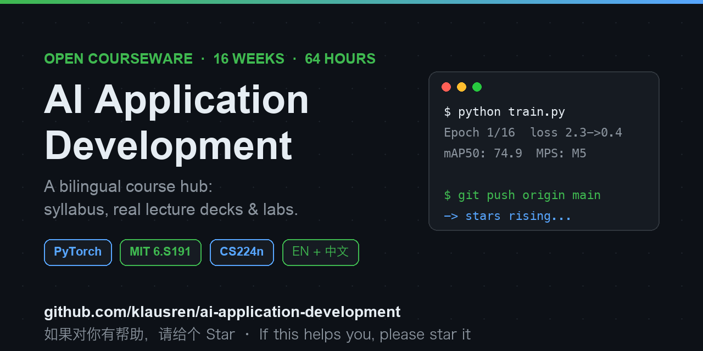

# AI Application Development — Course Hub

<div align="center">
  
</div>

**A 16-week, 64-hour university course taking software engineering students from zero to shipping AI applications.**

PyTorch-first · Lecture 90 min + Lab 75 min + Quiz 15 min every week · English-taught with Chinese support


[](https://github.com/klausren/ai-application-development/stargazers)

> ⭐ **New courseware lands every week during the semester.** If this repo saves you prep time, a **Star** keeps you in the loop and motivates the author — **Fork** it and make it your own course.

> 📕 **Follow the author on Xiaohongshu (RED)**: search **`改卷子的任老师`** — Xiaohongshu ID: **`63808230340`**
> 计算机老师的教学日常：AI 课程、课设救援、期末救命干货 / A CS teacher sharing AI course notes & student-project survival tips.

---

## Table of Contents

- [About This Course](#about-this-course)
- [Curriculum (16 Weeks)](#curriculum-16-weeks)
- [What's in This Repo](#whats-in-this-repo)
- [Courseware Map](#courseware-map)
- [Roadmap](#roadmap)
- [Quick Start](#quick-start)
- [Community](#community)
- [Cite This Repo](#cite-this-repo)
- [Attribution & License](#attribution--license)
- [中文说明](#中文说明)

---

## About This Course

This repository hosts the teaching materials for **AI Application Development**, a 4-credit major-core course designed for **junior software engineering students**. It is built around one philosophy:

> **Theory that holds up, applications that ship.**

- **4 modules in 16 weeks** — ML foundations → deep learning & computer vision → NLP & LLMs → AI application engineering
- **Every week is a 180-minute integrated session**: 90 min lecture + 75 min hands-on lab + 15 min quiz & wrap-up
- **PyTorch-first stack**: `torch` → `scikit-learn` → `transformers` (Hugging Face) → `FastAPI` deployment
- **Assessment built on building**: 3 assignments, a team midterm project, and a team capstone (35%) — no closed-book final exam grind

| | |
|---|---|
| **Prerequisites** | Python programming, data structures, databases, probability & statistics |
| **Textbooks** | *Hands-On Machine Learning* (Géron) · *Deep Learning with PyTorch* · *NLP with Transformers* (Hugging Face) |
| **Assessment** | Assignments ×3 (30%) · Midterm project (15%) · Capstone project (35%) · Labs & quizzes (20%) |

---

## Curriculum (16 Weeks)

### Module 1 · Machine Learning Foundations (Weeks 1–4)

| Week | Topic |
|:---:|---|
| 1 | Introduction & Development Environment Setup — course tour, Anaconda/Jupyter/Colab, the AI landscape |
| 2 | Data Handling Fundamentals for AI — data cleaning, feature engineering, the 5-step EDA workflow |
| 3 | Machine Learning Foundations — supervised learning, the `fit → predict → evaluate` pipeline |
| 4 | ML Applications & Model Evaluation — metrics, cross-validation, overfitting & regularization |

### Module 2 · Deep Learning & Computer Vision (Weeks 5–8)

| Week | Topic |
|:---:|---|
| 5 | Neural Network Fundamentals — perceptrons, backpropagation, activation functions |
| 6 | Training Deep Networks in Practice — optimizers, batch norm, dropout, learning-rate schedules |
| 7 | CNNs & Computer Vision — convolution, pooling, classic architectures, transfer learning |
| 8 | CV Applications & Midterm Project — image classification end-to-end + team project showcase |

### Module 3 · NLP & Large Language Models (Weeks 9–12)

| Week | Topic |
|:---:|---|
| 9 | NLP Fundamentals — tokenization, bag-of-words, TF-IDF, n-grams, text similarity |
| 10 | Word Embeddings & Sequence Models — Word2Vec / GloVe / FastText, RNN & LSTM, sentiment analysis |
| 11 | Transformers & Pre-trained Models — self-attention, the Transformer, BERT/GPT families, fine-tuning |
| 12 | LLMs, Prompt Engineering & RAG — prompting patterns, retrieval-augmented generation, evaluation |

### Module 4 · AI Application Engineering (Weeks 13–16)

| Week | Topic |
|:---:|---|
| 13 | Generative AI Applications & AI Agents — generative models in practice, agents, tool use |
| 14 | Model Deployment & API Engineering — FastAPI serving, model serialization, containerization |
| 15 | MLOps & Production Practices — experiment tracking, monitoring, CI for ML, cost & latency |
| 16 | Capstone Project Presentations — teams demo end-to-end AI products |

---

## What's in This Repo

```
ai-application-development/
├── README.md                  ← you are here
├── syllabus.md                ← full bilingual syllabus outline
├── lectures/                  ← original weekly slide decks (EN + CN), week-XX/lecture-{en,zh}.pptx
├── lesson-plans/              ← original A/B lesson plans (90-min lecture + 75-min lab), EN + CN
├── textbook/                  ← original bilingual textbook chapters
├── lecture-scripts/           ← original word-for-word lecture scripts (EN speech + CN reference)
├── handouts/                  ← printable A4 class handouts (bilingual, with note space)
├── labs/                      ← student-facing lab materials
│   ├── README.md              ← lab index + handout template explained
│   └── week-XX/
│       ├── lab-handout.md     ← 16 weekly lab guides (tasks, checkpoints, rubric)
│       ├── starter-notebook.ipynb, env-check.py, setup-guide.html   ← week-01
├── slides/
│   └── mit-6s191/             ← 6 official MIT 6.S191 lecture PDFs (bundled, MIT license)
├── cs224n/                    ← Stanford CS224n slot: fetched on demand (not bundled)
├── scripts/
│   └── download_cs224n.sh     ← one-click downloader for all 19 CS224n slide PDFs
├── THIRD_PARTY_NOTICES.md     ← attribution & redistribution terms for bundled materials
└── LICENSE                    ← CC BY-NC-SA 4.0 (this repo's own materials)
```

New weeks are pushed as the semester progresses — **watch** the repo (or the author's Xiaohongshu below) to catch each week's materials as they land.

---

## Courseware Map

The course deliberately leans on the world's best open teaching materials instead of reinventing every slide.

### Original: weekly courseware authored for this course

Every week ships five assets, each in **English** and **Chinese** (or bilingual):

| Folder | What's inside | Files per week |
|---|---|---|
| `lectures/` | the 32-page slide deck students see in class | `lecture-en.pptx`, `lecture-zh.pptx` |
| `lesson-plans/` | A: 90-min theory plan · B: 75-min lab plan (objectives, timing, activities, rubric) | `lecture-{en,zh}.html`, `lab-{en,zh}.html` |
| `textbook/` | self-contained bilingual chapter notes | `chapter-XX/{en,zh}.html` |
| `lecture-scripts/` | word-for-word English delivery script with Chinese reference (ASK/TIP/TIME cues) | `week-XX-bilingual.html` |
| `labs/` | student-facing starter notebook, environment checker, setup guide with FAQ | `starter-notebook.ipynb`, `env-check.py`, `setup-guide.html` |

**Currently published: Weeks 1–2** (all five asset types, both languages).

### Lab Handouts 实验指导书 — `labs/week-XX/lab-handout.md`

Every week's second half (课时 3–4, 75 min) is a hands-on lab. All **16** lab guides are published:

| Module | Weeks | Labs |
|---|:---:|---|
| ML Foundations | 1–4 | environment & first model · EDA/cleaning · sklearn pipeline · evaluation & regularization |
| Deep Learning & CV | 5–8 | NumPy→PyTorch MLP · training ablations · CNN & transfer learning · project lab |
| NLP & LLMs | 9–12 | text vectors · embeddings & LSTM · Transformers · prompting & RAG |
| AI Engineering | 13–16 | agents · FastAPI deployment · MLOps · demo day |

Each handout follows one template: **objectives → pre-lab checklist → tasks A–E (each with time budget, checkpoint and named pitfall) → deliverables → 100-pt rubric → submission → exit ticket → 中文摘要**. Downloads that may fail in class (MNIST, CIFAR-10, HuggingFace models) come with documented offline fallbacks.

### Class Handouts 课堂讲义 — `handouts/`

Printable A4 handouts for in-class use: key concepts, code skeletons, vocabulary tables, the lab plan for the day and ruled note space. Bilingual, print-ready (`Cmd+P`). **Week 1** is available now.

### Bundled: MIT 6.S191 (2024) — included in `slides/mit-6s191/`

| File | Lecture | Maps to |
|---|---|---|
| `01-deep-learning-basics.pdf` | Intro to Deep Learning | Weeks 5–6 |
| `02-deep-sequence-modeling.pdf` | Deep Sequence Modeling | Week 10 |
| `03-deep-computer-vision.pdf` | Deep Computer Vision | Week 7 |
| `04-deep-generative-modeling.pdf` | Deep Generative Modeling | Week 13 |
| `05-deep-reinforcement-learning.pdf` | Deep Reinforcement Learning | Week 13 (extension) |
| `06-new-frontiers.pdf` | New Frontiers | Weeks 13–16 (frontier reading) |

### On-demand: Stanford CS224n (Spring 2024) — fetched by script

| Lectures | Topic cluster | Maps to |
|---|---|---|
| L01–L03 | Word vectors, GloVe, neural net basics | Week 9 |
| L04–L06, L08 | Dependency parsing, RNNs, attention, **Transformers** | Weeks 10–11 |
| L09–L12 | Pre-training, prompting & RLHF, evaluation, training | Weeks 11–12 |
| L14–L19 | Agents, DPO, CNN/TreeRNN, human-centered NLP, deployment, open problems | Weeks 12–13 (extension) |

---

## Roadmap

This repo grows with the live semester — one week of courseware lands roughly every 7 days:

- [x] **Weeks 1–2** — course intro, environment setup, data handling (all 5 asset types, EN + CN)
- [x] Curated slide pack: MIT 6.S191 (bundled) + CS224n downloader
- [x] **All 16 lab handouts** — full lab curriculum published (see `labs/`)
- [x] **Week 1 class handout** — printable A4, bilingual
- [ ] **Weeks 3–4** — ML foundations, model evaluation *(in progress — teaching it right now)*
- [ ] **Weeks 5–8** — deep learning & computer vision module
- [ ] **Weeks 9–12** — NLP & LLM module (Transformers, RAG)
- [ ] **Weeks 13–16** — deployment, MLOps, capstone templates
- [ ] Starter notebooks for weeks 2–16 (week-01 shipped)
- [ ] Micro-lesson video series (animated, 1080p)
- [ ] Assignments ×3 with autograding notebooks

💡 **Want a specific week sooner?** [Open a discussion](https://github.com/klausren/ai-application-development/discussions) — priorities go to what teachers actually ask for.

---

## Quick Start

```bash
# 1. Clone
git clone https://github.com/klausren/ai-application-development.git
cd ai-application-development

# 2. (Optional) Fetch all 19 Stanford CS224n slide PDFs (~90 MB)
bash scripts/download_cs224n.sh
```

MIT 6.S191 slides are already in the repo — open `slides/mit-6s191/` and start reading.

Instructors: see [Attribution & License](#attribution--license) before reusing any slide in your own classroom.

---

## Community

- 💬 **Questions & ideas** → [Discussions](https://github.com/klausren/ai-application-development/discussions) — teaching questions welcome, especially "how do you teach X?"
- 🐛 **Found a typo / broken link / notebook error** → [open an issue](https://github.com/klausren/ai-application-development/issues/new?template=bug_report.md)
- 🧑‍🏫 **Used this in your own classroom?** → tell us in [Show & Tell](https://github.com/klausren/ai-application-development/discussions/categories/show-and-tell) — real classroom feedback shapes the next weeks
- 🤝 **Want to contribute?** → read [CONTRIBUTING.md](CONTRIBUTING.md) (PRs for Week 3+ materials are especially welcome)

---

## Repo Maintenance

Two GitHub Actions keep this repo honest:

| Workflow | Trigger | What it does |
|---|---|---|
| [`link-check.yml`](.github/workflows/link-check.yml) | Mondays 03:00 UTC, or manual | scans every `.md` for dead links; files an issue titled "🔗 Link checker found broken links" |
| [`greetings.yml`](.github/workflows/greetings.yml) | first-time issue / PR | posts a welcome message pointing teachers to Discussions |

Run the link check by hand: **Actions → Check links in markdown → Run workflow**.

---

## Cite This Repo

If you use these materials in teaching or research, please cite:

[](https://github.com/klausren/ai-application-development/releases)

```bibtex
@misc{ren2026aiappdev,
  author       = {Ren, Zheng},
  title        = {AI Application Development: A 16-Week Bilingual Course Hub},
  year         = {2026},
  howpublished = {\url{https://github.com/klausren/ai-application-development}},
  note         = {Course hub: syllabus, lecture decks, labs, curated MIT 6.S191 \& CS224n slides}
}
```

---

## Attribution & License

| Content | License | Redistribution in this repo |
|---|---|---|
| This repo's own materials (syllabus, scripts, README, future lecture notes) | **CC BY-NC-SA 4.0** | — see `LICENSE` |
| MIT 6.S191 slides (2024) | **MIT License** (per the official 6.S191 FAQ) | ✅ bundled in `slides/mit-6s191/` with `LICENSE-MIT.md` |
| Stanford CS224n slides (2024 Spring) | no explicit open license | ❌ not bundled — fetched from the official source by script |

**Instructor note (from the MIT 6.S191 official FAQ):** if you reuse their slides in your own teaching, you must keep the following reference on each slide:

> © Alexander Amini and Ava Soleimany · MIT 6.S191: Introduction to Deep Learning · IntroToDeepLearning.com

Full details in [`THIRD_PARTY_NOTICES.md`](THIRD_PARTY_NOTICES.md).

---

## 中文说明

本仓库是《AI 应用开发》课程的教学资源中心，配套大纲与课件包持续更新中。

- **课程定位**：大三软件工程专业 · 4 学分 · 64 学时（16 周 × 180 分钟一体课 = 理论 90 min + Lab 75 min + 随堂小测 15 min）
- **技术栈**：PyTorch 为主线，配合 scikit-learn、Hugging Face Transformers、FastAPI
- **四大模块**：机器学习基础（W1-4）→ 深度学习与计算机视觉（W5-8）→ NLP 与大语言模型（W9-12）→ AI 应用工程化（W13-16）
- **课件策略**：不重复造轮子——深度学习部分直接采用 MIT 6.S191 官方课件（已打包入库，MIT 许可），NLP/LLM 部分配套 Stanford CS224n 一键下载脚本（版权原因不入库）
- **考核方式**：平时作业 ×3（30%）+ 期中团队项目（15%）+ 期末 Capstone（35%）+ 实验与随堂测验（20%），不考闭卷

详细课程安排见 [`syllabus.md`](syllabus.md)。

### 关注我 📕

教学日常、课件更新预告、学生项目避坑指南都在小红书：

> **小红书号：`63808230340`**（App 内搜索即可关注）｜账号：**改卷子的任老师**

### 支持 ⭐

如果这套课程设计对你有帮助：

1. **点个 Star** ⭐ —— 每周更新课件，Star 是最好的追更方式
2. **Fork 一份** —— 把它改造成你自己的课程，改完欢迎回来分享
3. **告诉同行** —— 转给身边也在备 AI 课的老师，比 star 更珍贵

<div align="center">
  <a href="https://star-history.com/#klausren/ai-application-development&Date">
    <picture>
      <source media="(prefers-color-scheme: dark)" srcset="https://api.star-history.com/svg?repos=klausren/ai-application-development&type=Date&theme=dark" />
      <source media="(prefers-color-scheme: light)" srcset="https://api.star-history.com/svg?repos=klausren/ai-application-development&type=Date" />
      
    </picture>
  </a>
</div>
