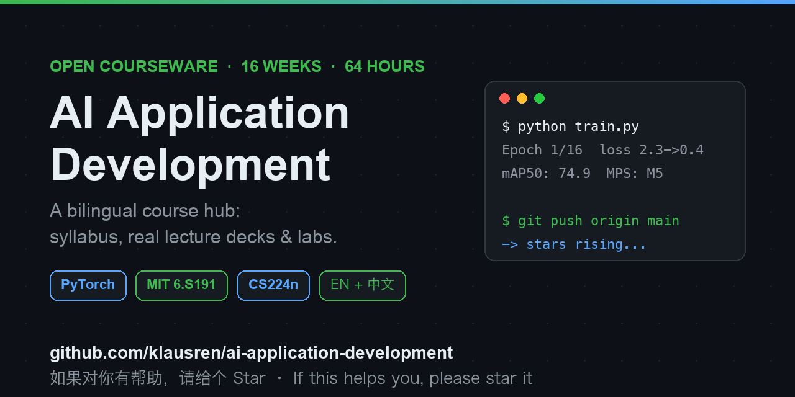

# AI Application Development — Course Hub

<div align="center">
  
</div>

**A 16-week, 64-hour university course taking software engineering students from zero to shipping AI applications.**

PyTorch-first · Lecture 90 min + Lab 80 min + Wrap-up 10 min every week · English-taught with Chinese support


[](https://github.com/klausren/ai-application-development/stargazers)

> ⭐ **New courseware lands every week during the semester.** If this repo saves you prep time, a **Star** keeps you in the loop and motivates the author — **Fork** it and make it your own course.

> 📕 **Follow the author on Xiaohongshu (RED)**: search **`改卷子的任老师`** — Xiaohongshu ID: **`63808230340`**
> 计算机老师的教学日常：AI 课程、课设救援、期末救命干货 / A CS teacher sharing AI course notes & student-project survival tips.

---

## Table of Contents

- [About This Course](#about-this-course)
- [Curriculum (16 Weeks)](#curriculum-16-weeks)
- [What's in This Repo](#whats-in-this-repo)
- [Courseware Map](#courseware-map)
- [Roadmap](#roadmap)
- [Quick Start](#quick-start)
- [Community](#community)
- [Cite This Repo](#cite-this-repo)
- [Attribution & License](#attribution--license)
- [中文说明](#中文说明)

---

## About This Course

This repository hosts the teaching materials for **AI Application Development**, a 4-credit major-core course designed for **junior software engineering students**. It is built around one philosophy:

> **Theory that holds up, applications that ship.**

- **4 modules in 16 weeks** — AI application foundations & PyTorch → deep learning core techniques & model training → transfer learning, LLMs & RAG → engineering, deployment & the capstone
- **Every week is a 180-minute integrated session**: 90 min lecture + 80 min hands-on lab + 10 min wrap-up
- **PyTorch-first stack**: `torch` → `scikit-learn` → `transformers` (Hugging Face) → serving the model
- **Assessment built on building**: 14 weekly labs (实验 0–13), four module milestone reviews, an AI-collaboration log, and an **individual capstone worth 50%** — no closed-book final exam

Everything here is traceable to the school's official course documents for course code
**52015CC3BV** (课程标准 / 教案 / 教学日历 / 考试大纲); [`syllabus.md`](syllabus.md) is the
single source of truth for this repo's scope and sequencing.

| | |
|---|---|
| **Prerequisites** | Programming fundamentals (Python), data structures, calculus & linear algebra basics, introductory machine learning |
| **Textbook** | *动手学深度学习* (**Dive into Deep Learning**, PyTorch edition) · 阿斯顿·张、李沐 等，人民邮电出版社 |
| **Assessment** | Formative 50% — attendance 10 · weekly labs 15 · module milestones 15 · AI-collaboration log 10<br>Summative 50% — the individual capstone project (no closed-book exam) |

---

## Curriculum (16 Weeks)

### Module 1 · AI Application Foundations & PyTorch (Weeks 1–4) · 基础与 PyTorch 入门

| Week | CU | Topic |
|:---:|:---:|---|
| 1 | CU1 | Introduction to AI Application Development — the pipeline, the job-role competency model, environment & GPU verification, reproducibility and the AI-usage boundary |
| 2 | CU2 | PyTorch Fundamentals: Tensors and Autograd — shapes, broadcasting, the computation graph, hand-written gradient descent |
| 3 | CU3 | Data Preparation and Pipelines — splits and data leakage, custom `Dataset` / `DataLoader`, augmentation and imbalanced data |
| 4 | CU4 | Neural Networks and Modelling with `nn.Module` — depth vs linear models, the canonical module structure, width/depth ablations |

### Module 2 · Deep Learning Core Techniques & Model Training (Weeks 5–8) · 深度学习核心技术与模型训练

| Week | CU | Topic |
|:---:|---|
| 5 | CU5 | Training Loop, Loss and Optimizer — the five-step loop, three loss functions, SGD / Momentum / Adam × learning rate |
| 6 | CU6 | Evaluation, Overfitting and Regularization — metrics and confusion matrix, evaluation protocol, bias–variance, early stopping / weight decay / Dropout / augmentation |
| 7 | CU7 | CNNs for Computer Vision — convolution and pooling, classic architectures, confusion-matrix error analysis |
| 8 | CU8 | Sequence Models and Text Data — tokenization, vocabulary, embeddings, RNN/LSTM, text classification |

### Module 3 · Modern AI Applications: Transfer Learning, LLMs and RAG (Weeks 9–12) · 迁移学习、大模型与 RAG

| Week | CU | Topic |
|:---:|---|
| 9 | CU9 | Transfer Learning and Pretrained Models — fine-tuning vs training from scratch, when pre-training pays off |
| 10 | CU10 | Attention and Transformers — self-attention, the Transformer block, text classification against the Week 8 LSTM |
| 11 | CU11 | Large Language Models and Prompt Engineering — LLM APIs, prompting patterns, strict JSON output and retry strategies |
| 12 | CU12 | Retrieval-Augmented Generation (RAG) — retrieval → generation → citation, and where such pipelines fail |

### Module 4 · Engineering, Deployment and the Capstone (Weeks 13–16) · 工程化、部署与综合项目

| Week | CU | Topic |
|:---:|---|
| 13 | CU13 | Model Deployment and Inference Serving — export, HTTP endpoint, P50/P95 latency |
| 14 | CU14 | MLOps: Tracking, Versioning and Monitoring — experiment tracking, parameter–metric tables, monitoring and drift |
| 15 | CU15 | Responsible AI: Fairness, Explainability and Safety — seminar on the *AI Application Ethics & Safety Review Form* |
| 16 | CU16 | Capstone Acceptance and Course Review — final acceptance and defence of the individual project |

---

## What's in This Repo

```
ai-application-development/
├── README.md                  ← you are here
├── syllabus.md                ← full bilingual syllabus outline — this repo's 口径源
├── lectures/                  ← original weekly slide decks (EN + CN), week-XX/lecture-{en,zh}.pptx
├── lesson-plans/              ← original lesson plans (90-min lecture + 80-min lab), EN + CN
├── textbook/                  ← original bilingual textbook chapters
├── labs/                      ← student-facing lab materials
│   ├── README.md              ← lab index + handout template explained
│   └── week-XX/
│       ├── lab-handout.md     ← weekly lab guides (Parts A–F, checkpoints, rubric)
│       └── starter-notebook.ipynb, env-check.py, setup-guide.html   ← week-01
├── projects/
│   └── capstone/              ← individual final project: brief, project &
│       │                         defence rubrics, weekly milestones, DATA/MODEL_CARD/DEVLOG templates
├── outputs/                   ← the measured experiment results the courseware numbers come from
├── slides/
│   └── mit-6s191/             ← 6 official MIT 6.S191 lecture PDFs (bundled, MIT license)
├── cs224n/                    ← Stanford CS224n slot: fetched on demand (not bundled)
├── scripts/
│   ├── build_deck.py          ← deck generator (native shapes only — no image can fail to display)
│   ├── deck_specs/week-XX.py  ← language-neutral spec, one per week
│   ├── validate_deck.py       ← page-count / CJK-leak / media-file checker
│   └── download_cs224n.sh     ← one-click downloader for all 19 CS224n slide PDFs
├── THIRD_PARTY_NOTICES.md     ← attribution & redistribution terms for bundled materials
└── LICENSE                    ← CC BY-NC-SA 4.0 (this repo's own materials)
```

New weeks are pushed as the semester progresses — **watch** the repo (or the author's Xiaohongshu below) to catch each week's materials as they land.

---

## Courseware Map

The course deliberately leans on the world's best open teaching materials instead of reinventing every slide.

### Original: weekly courseware authored for this course

Every week ships four assets, each in **English** and **Chinese** (or bilingual):

| Folder | What's inside | Files per week |
|---|---|---|
| `lectures/` | the slide deck students see in class (27–30 slides) | `lecture-en.pptx`, `lecture-zh.pptx` |
| `lesson-plans/` | lecture plan + lab plan (objectives, timing, activities, rubric) | `lecture-{en,zh}.html`, `lab-{en,zh}.html` |
| `textbook/` | self-contained bilingual chapter notes (8 sections + practice) | `chapter-XX/{en,zh}.html` |
| `labs/` | the student-facing lab guide | `lab-handout.md` |

**Currently published (Week 1–6 = CU1–CU6, 实验 0–5):**

| Week | Deck (EN+CN) | Lesson plans | Textbook | Lab handout |
|:---:|:---:|:---:|:---:|:---:|
| 1 | ✅ | ✅ | ✅ | ✅ |
| 2 | ✅ | ✅ | ✅ | ✅ |
| 3 | ✅ | ✅ | ✅ | ✅ |
| 4 | ✅ | ✅ | ✅ | ✅ |
| 5 | ✅ | ✅ | ✅ | ✅ |
| 6 | ✅ | ✅ | ✅ | ✅ |
| 7–16 | — | — | — | — (landing weekly) |

Decks are built by `scripts/build_deck.py` from a language-neutral spec (`scripts/deck_specs/week-XX.py`) — every visual is a native PowerPoint shape, table or chart, so **no image ever fails to display** (0 media files per deck). `scripts/validate_deck.py` checks the page count, the EN/CN parity and CJK leakage on every build.

### Lab Handouts 实验指导书 — `labs/week-XX/lab-handout.md`

Every week's second half (**80 min lab + 10 min wrap-up**) is a hands-on lab. Lab numbering follows the
official calendar — **实验 0–13 across Week 1–14**; Week 15 is the ethics seminar and Week 16 is
capstone acceptance, so neither carries a lab number.

| Module | Weeks | Labs |
|---|:---:|---|
| 一 · foundations & PyTorch | 1–4 | environment & GPU verification · tensors & autograd · data pipelines · `nn.Module` ablations |
| 二 · deep learning core | 5–8 | training loop & optimizer grid · overfitting & regularization · CNN error analysis · sequence models |
| 三 · transfer learning, LLMs & RAG | 9–12 | fine-tuning vs from-scratch · Transformer vs LSTM · LLM JSON output & retries · RAG chain & failure analysis |
| 四 · engineering & capstone | 13–16 | deployment & latency · MLOps & monitoring · ethics seminar · acceptance defence |

Each handout follows one template: **objectives → pre-lab checklist → tasks A–E (each with time budget, checkpoint and named pitfall) → Part F capstone milestone → deliverables → 100-pt rubric → submission → exit ticket → 中文摘要**. Downloads that may fail in class (torchvision MNIST, CIFAR-10, HuggingFace models) come with documented offline fallbacks — and Week 6 needs no download at all.

**Part F is how the labs connect to the final project** — every lab ends by pushing one milestone (and a `DEVLOG.md` entry) to your capstone repo, so the project is built continuously instead of in a Week-15 panic.

### Capstone Project 大作业 — `projects/capstone/`

An **individual** project worth **50%** of the final grade, with the topic agreed with the
instructor in Week 2 and the scope negotiated as an MVP + stretch list. No peer-evaluation
coefficient: the process portion measures the **git history and weekly `DEVLOG.md`** directly,
and every student defends their own work one-on-one in Week 16. Full brief and rubrics:

| File | What's in it |
|---|---|
| [`README.md`](projects/capstone/README.md) | brief, topic-selection process, AI-usage policy, deliverables |
| [`rubric-project.md`](projects/capstone/rubric-project.md) | project rubric — the artefact |
| [`rubric-defence.md`](projects/capstone/rubric-defence.md) | defence & process rubric — defence, git trace + DEVLOG, retrospective, AI use |
| [`milestones.md`](projects/capstone/milestones.md) | weekly milestones, one push per week |
| `templates/` | `DATA.md`, `MODEL_CARD.md`, `RETROSPECTIVE.md`, `DEVLOG.md` |

### Bundled: MIT 6.S191 (2024) — included in `slides/mit-6s191/`

| File | Lecture | Maps to |
|---|---|---|
| `01-deep-learning-basics.pdf` | Intro to Deep Learning | Weeks 2–5 |
| `02-deep-sequence-modeling.pdf` | Deep Sequence Modeling | Week 8 |
| `03-deep-computer-vision.pdf` | Deep Computer Vision | Week 7 |
| `04-deep-generative-modeling.pdf` | Deep Generative Modeling | Weeks 15–16 (frontier reading) |
| `05-deep-reinforcement-learning.pdf` | Deep Reinforcement Learning | Weeks 15–16 (extension) |
| `06-new-frontiers.pdf` | New Frontiers | Weeks 15–16 (frontier reading) |

### On-demand: Stanford CS224n (Spring 2024) — fetched by script

| Lectures | Topic cluster | Maps to |
|---|---|---|
| L01–L03 | Word vectors, GloVe, neural net basics | Week 8 |
| L04–L06, L08 | Dependency parsing, RNNs, attention, **Transformers** | Weeks 8–10 |
| L09–L12 | Pre-training, prompting & RLHF, evaluation, training | Week 11 |
| L14–L19 | Agents, DPO, CNN/TreeRNN, human-centered NLP, deployment, open problems | Weeks 12–14 (extension) |

---

## Roadmap

This repo grows with the live semester — one week of courseware lands roughly every 7 days:

- [x] Curated slide pack: MIT 6.S191 (bundled) + CS224n downloader
- [x] **Week 1–6 — module 1 and the first half of module 2** (decks EN+CN, lesson plans, textbook chapters, lab handouts 实验 0–5)
- [x] Deck generator with zero media files (`scripts/build_deck.py` + `validate_deck.py`)
- [x] Capstone converted to an **individual** project (brief, rubrics, milestones, templates)
- [ ] **Week 7 — CNNs & computer vision** (实验 6: CNN classification + confusion-matrix error analysis) *(next)*
- [ ] **Week 8 — sequence models & text data** (实验 7)
- [ ] **Weeks 9–12** — transfer learning, Transformers, LLM prompting, RAG
- [ ] **Weeks 13–16** — deployment, MLOps, responsible AI, capstone acceptance
- [ ] Starter notebooks for weeks 2–16 (week-01 shipped)
- [ ] Micro-lesson video series (animated, 1080p)

💡 **Want a specific week sooner?** [Open a discussion](https://github.com/klausren/ai-application-development/discussions) — priorities go to what teachers actually ask for.

---

## Quick Start

```bash
# 1. Clone
git clone https://github.com/klausren/ai-application-development.git
cd ai-application-development

# 2. (Optional) Fetch all 19 Stanford CS224n slide PDFs (~90 MB)
bash scripts/download_cs224n.sh
```

MIT 6.S191 slides are already in the repo — open `slides/mit-6s191/` and start reading.

Instructors: see [Attribution & License](#attribution--license) before reusing any slide in your own classroom.

---

## Community

- 💬 **Questions & ideas** → [Discussions](https://github.com/klausren/ai-application-development/discussions) — teaching questions welcome, especially "how do you teach X?"
- 🐛 **Found a typo / broken link / notebook error** → [open an issue](https://github.com/klausren/ai-application-development/issues/new?template=bug_report.md)
- 🧑‍🏫 **Used this in your own classroom?** → tell us in [Show & Tell](https://github.com/klausren/ai-application-development/discussions/categories/show-and-tell) — real classroom feedback shapes the next weeks
- 🤝 **Want to contribute?** → read [CONTRIBUTING.md](CONTRIBUTING.md) (PRs for Week 7+ materials are especially welcome)

---

## Repo Maintenance

Two GitHub Actions keep this repo honest:

| Workflow | Trigger | What it does |
|---|---|---|
| [`link-check.yml`](.github/workflows/link-check.yml) | Mondays 03:00 UTC, or manual | scans every `.md` for dead links; files an issue titled "🔗 Link checker found broken links" |
| [`greetings.yml`](.github/workflows/greetings.yml) | first-time issue / PR | posts a welcome message pointing teachers to Discussions |

Run the link check by hand: **Actions → Check links in markdown → Run workflow**.

---

## Cite This Repo

If you use these materials in teaching or research, please cite:

[](https://github.com/klausren/ai-application-development/releases)

```bibtex
@misc{ren2026aiappdev,
  author       = {Ren, Zheng},
  title        = {AI Application Development: A 16-Week Bilingual Course Hub},
  year         = {2026},
  howpublished = {\url{https://github.com/klausren/ai-application-development}},
  note         = {Course hub: syllabus, lecture decks, labs, curated MIT 6.S191 \& CS224n slides}
}
```

---

## Attribution & License

| Content | License | Redistribution in this repo |
|---|---|---|
| This repo's own materials (syllabus, scripts, README, lecture notes) | **CC BY-NC-SA 4.0** | — see `LICENSE` |
| MIT 6.S191 slides (2024) | **MIT License** (per the official 6.S191 FAQ) | ✅ bundled in `slides/mit-6s191/` with `LICENSE-MIT.md` |
| Stanford CS224n slides (2024 Spring) | no explicit open license | ❌ not bundled — fetched from the official source by script |

**Instructor note (from the MIT 6.S191 official FAQ):** if you reuse their slides in your own teaching, you must keep the following reference on each slide:

> © Alexander Amini and Ava Soleimany · MIT 6.S191: Introduction to Deep Learning · IntroToDeepLearning.com

Full details in [`THIRD_PARTY_NOTICES.md`](THIRD_PARTY_NOTICES.md).

---

## 中文说明

本仓库是《AI 应用开发》课程的教学资源中心，配套大纲与课件包持续更新中。课程代码 **52015CC3BV**，开课单位为大连东软信息学院软件学院·软件与大数据技术系，授课对象为软件工程（来华项目）2024 级本科生。

- **课程定位**：4 学分 · 64 学时 · 每周一次 180 分钟一体课 = **讲授 90 min + 随堂实验 80 min + 小结 10 min**
- **技术栈**：PyTorch 为主线，配合 scikit-learn、Hugging Face Transformers，并最终把模型部署成接口
- **四大模块**：AI 应用开发基础与 PyTorch 入门（W1–4）→ 深度学习核心技术与模型训练（W5–8）→ 现代 AI 应用：迁移学习、大模型与 RAG（W9–12）→ 工程化、部署与综合项目（W13–16）
- **课件策略**：不重复造轮子——深度学习部分配套 MIT 6.S191 官方课件（已打包入库，MIT 许可），NLP/LLM 部分配套 Stanford CS224n 一键下载脚本（版权原因不入库）
- **考核方式**：**形成性 50**（出勤与课堂参与 10 + 随堂实验 15 + 阶段评审 15 + AI 协同记录 10）+ **终结性 50**（个人项目成果物），为考查课、**无闭卷笔试**，且大作业是**个人项目**（无同伴评价系数）

详细课程安排见 [`syllabus.md`](syllabus.md)。

### 课程资源导航

| 目录 | 内容 |
|---|---|
| [`syllabus.md`](syllabus.md) | 课程大纲（与学校四份官方文档同口径，本仓库的口径源） |
| `lectures/week-XX/` | 中英双版幻灯片（原生形状，零图片） |
| `lesson-plans/week-XX/` | 讲授教案与实验教案（中英双版） |
| `textbook/chapter-XX/` | 双语教材章节（8 节 + 练习） |
| `labs/week-XX/lab-handout.md` | 实验指导书（实验 0–13） |
| `projects/capstone/` | 个人大作业：任务书、评分标准、周里程碑、模板 |
| `outputs/` | 课件中所有实验数字的实测结果（单一真相源） |

### 关注我 📕

教学日常、课件更新预告、学生项目避坑指南都在小红书：

> **小红书号：`63808230340`**（App 内搜索即可关注）｜账号：**改卷子的任老师**

### 支持 ⭐

如果这套课程设计对你有帮助：

1. **点个 Star** ⭐ —— 每周更新课件，Star 是最好的追更方式
2. **Fork 一份** —— 把它改造成你自己的课程，改完欢迎回来分享
3. **告诉同行** —— 转给身边也在备 AI 课的老师，比 star 更珍贵

<div align="center">
  <a href="https://star-history.com/#klausren/ai-application-development&Date">
    <picture>
      <source media="(prefers-color-scheme: dark)" srcset="https://api.star-history.com/svg?repos=klausren/ai-application-development&type=Date&theme=dark" />
      <source media="(prefers-color-scheme: light)" srcset="https://api.star-history.com/svg?repos=klausren/ai-application-development&type=Date" />
      
    </picture>
  </a>
</div>
